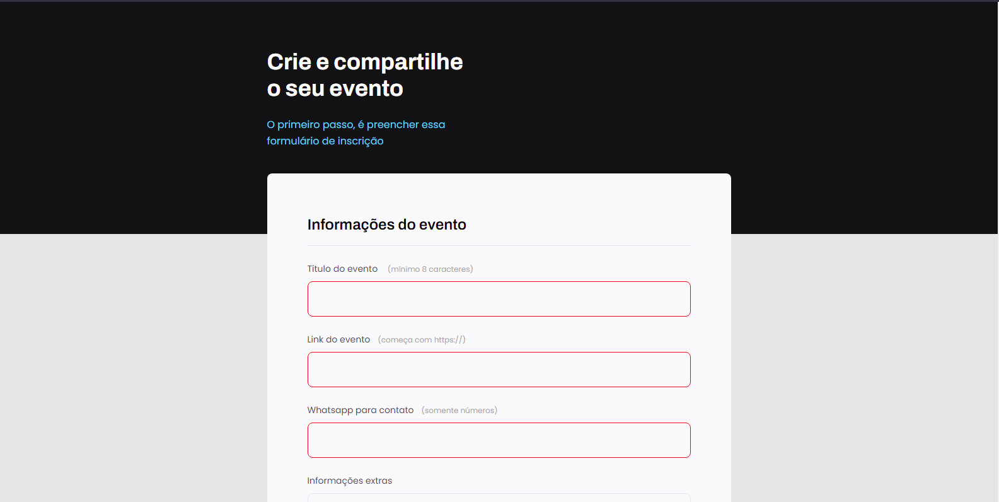
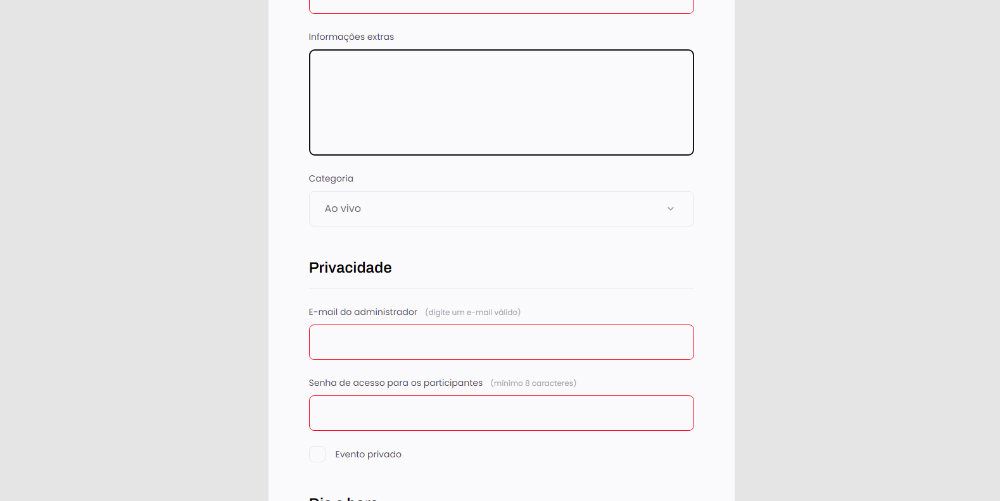
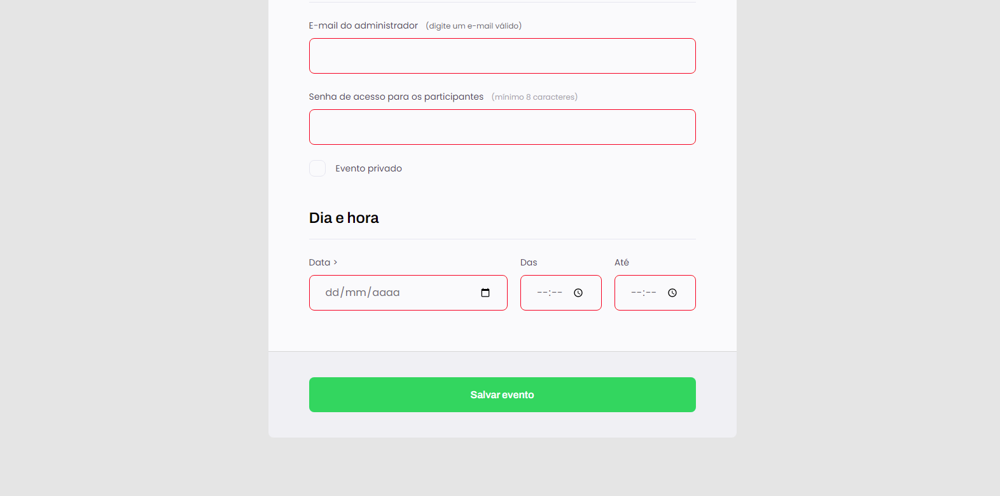

<h1 align="center">
	Explorer-Stage03-Formulário de validação
</h1>

<h3 align="center">
	Projeto desenvolvido na  formação explorer da rocketseat
</h3>

	
	

<h4 align="center">
	Status: 🚀 Finalizado
</h4>

	<a href="#sobre">Sobre</a> •
	<a href="#funcionalidades">Funcionalidades</a> •
	<a href="#tecnologias">Tecnologias</a> •
	<a href="#autor">Autor</a> 

## Sobre

Projeto simples de um formulário de cadastro para um evento, contento campos de nome, e-mail, contato, data e um botão para validar e enviar as informações, Nesse projeto é abordado as tags HTML semânticas para uso de formulários em uma página “web”. Também é adicionado regras para validação dos campos.

## Funcionalidades

- [x] Inserção de campos de um formulário
- [x] Validação dos campos conforme a informação requisitada
- [x] Obrigatoriedade em alguns campos

## Tecnologias

&nbsp;
&nbsp;

## Imagens

## Autor

Criado por [Willian Amaro Gomes](https://github.com/williangomesdev)

&nbsp;
&nbsp;

 
